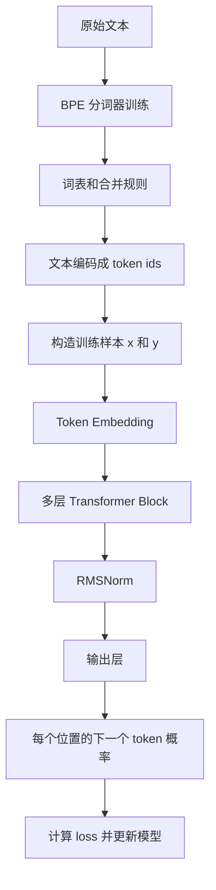

# 小语言模型训练项目

这个项目实现了一条从文本到小语言模型训练、再到文本生成的完整流程。

它包含两部分：

- `bpe_tokenizer`：把文本切成 token，并把 token 转成数字。
- `language_model`：一个小型 GPT 风格语言模型，用来学习“根据前面的 token 预测下一个 token”。

## 整体流程



训练时，模型看到的是一段 token id，例如：

```text
x = [10, 25, 87, 43]
y = [25, 87, 43, 91]
```

也就是说，模型在每个位置都要预测“下一个 token 是什么”。

## 当前模型结构

当前模型是一个小型 GPT 风格的自回归语言模型。它的结构是：

```text
输入 token ids
  -> Token Embedding
  -> Transformer Block 1
  -> Transformer Block 2
  -> ...
  -> Transformer Block N
  -> Final RMSNorm
  -> Linear Output Head
  -> logits
```

默认训练脚本里的小模型配置是：

```python
{
    "vocab_size": 512,
    "context_length": 64,
    "n_embd": 96,
    "n_layer": 3,
    "n_head": 3,
    "dropout_rate": 0.1,
    "qkv_bias": False,
    "rope_theta": 10000.0,
    "norm_type": "rmsnorm",
    "ffn_type": "swiglu"
}
```

这些参数的含义：

- `vocab_size`：词表大小，也就是模型最后要预测多少种 token。
- `context_length`：模型一次最多看多少个 token。
- `n_embd`：每个 token 会被表示成多少维向量。
- `n_layer`：Transformer Block 的层数。
- `n_head`：注意力头数量。
- `dropout_rate`：训练时随机丢弃一部分信息，减少过拟合。
- `qkv_bias`：注意力里的 Q、K、V 线性层是否使用偏置。
- `rope_theta`：RoPE 位置编码的频率基数。
- `norm_type`：默认使用 RMSNorm，也可以切换成 LayerNorm。
- `ffn_type`：默认使用 SwiGLU，也可以切换成 GELU 前馈网络。

## 文件结构

```text
bpe_tokenizer/
  tokenizer.py        BPE 分词器核心逻辑
  ALGORITHM.md        BPE 算法说明和时序图

language_model/
  tokenization.py     分词器训练、文本准备、token 编码
  data.py             构造训练 batch
  training.py         验证误差、学习率调度、检查点保存
  config.py           模型配置和参数检查
  norms.py            RMSNorm 和 LayerNorm 选择
  rope.py             RoPE 位置编码
  attention.py        带 RoPE 的因果自注意力
  feed_forward.py     前馈网络
  blocks.py           Transformer Block
  gpt.py              完整 GPT 风格模型
  generation.py       文本生成逻辑
  model.py            兼容旧导入方式

scripts/
  train_small_model.py  训练入口
  generate_text.py      生成入口

examples/
  tiny_corpus.txt       示例训练文本
```

## 分词器

模型不能直接处理字符串，所以第一步是把文本变成数字。

这里使用 byte-level BPE：

1. 先把文本按 UTF-8 字节表示。
2. 初始词表包含 256 个基础字节。
3. 训练时不断寻找最常见的相邻组合。
4. 把高频组合合并成新的 token。
5. 最后得到词表和合并规则。

这样做的好处是：中文、英文、emoji、标点都能被表示，不需要额外的未知字符。

特殊 token，比如 `<|endoftext|>`，会被单独保留，不会被拆开。

详细 BPE 说明见 [bpe_tokenizer/ALGORITHM.md](bpe_tokenizer/ALGORITHM.md)。

## Token Embedding

分词器输出的是数字 id，但模型需要向量。

Token Embedding 的作用是：

```text
token id -> 向量
```

例如 token id 是 `42`，模型会从 embedding 表里取出第 42 行向量。这个向量一开始是随机的，训练过程中会被不断更新。

当前模型不再使用传统的可学习位置 embedding。位置信息交给 RoPE，在注意力层内部处理。

## RoPE 位置编码

语言模型必须知道 token 的顺序。比如：

```text
我 喜欢 你
你 喜欢 我
```

这两句话 token 一样，但顺序不同，意思也不同。

以前常见做法是给每个位置加一个位置向量。当前模型使用 RoPE，也就是 Rotary Position Embedding。

RoPE 的核心思想是：

- 不直接给 token 向量加位置向量。
- 而是在注意力层里，对 Query 和 Key 做旋转。
- 不同位置旋转角度不同。
- 这样注意力计算时就能感知 token 之间的相对位置。

在代码里，RoPE 分两步：

1. `build_rope_cache` 预先生成每个位置需要的 `cos` 和 `sin`。
2. `apply_rope` 把 Query 和 Key 按偶数维、奇数维成对旋转。

RoPE 只作用在 Query 和 Key 上，不作用在 Value 上。

## RMSNorm

当前模型默认使用 RMSNorm。

RMSNorm 的作用是让每层输入的数值规模更稳定，训练更容易。它和 LayerNorm 的区别是：

- LayerNorm 会减去均值，再除以标准差。
- RMSNorm 不减均值，只按均方根缩放。

简单理解：

```text
RMSNorm(x) = x / sqrt(mean(x^2) + eps) * weight
```

它更简单，计算更少，也是很多新模型常用的归一化方式。

如果需要切回 LayerNorm，可以在训练时加：

```bash
--norm-type layernorm
```

## 因果自注意力

注意力层负责让每个 token 读取前面 token 的信息。

当前实现是 causal self-attention，也就是因果自注意力。它有一个关键限制：

```text
第 5 个 token 可以看第 1 到第 5 个 token
第 5 个 token 不能看第 6 个 token
```

这样训练目标才不会泄漏答案。

注意力层内部流程：

```text
输入 x
  -> 线性层生成 Q、K、V
  -> 拆成多个 head
  -> 对 Q、K 应用 RoPE
  -> 计算 QK 相似度
  -> 加 causal mask
  -> softmax 得到注意力权重
  -> 权重乘以 V
  -> 拼回所有 head
  -> 输出线性层
```

Q、K、V 的直观含义：

- Query：当前位置想找什么信息。
- Key：每个位置能提供什么信息的索引。
- Value：每个位置真正提供的内容。

多头注意力的作用是让模型从不同角度看上下文。例如一个 head 可能关注语法关系，另一个 head 可能关注重复词或局部模式。

## 前馈网络

注意力层负责在 token 之间传递信息，前馈网络负责对每个 token 自己的表示做进一步加工。

当前默认前馈网络是 SwiGLU，结构可以理解成两条支路：

```text
输入 x
  -> gate 分支：Linear -> SiLU
  -> up 分支：Linear
  -> 两条分支相乘
  -> down 分支：Linear
  -> Dropout
```

SwiGLU 相比普通 GELU 前馈层多了一个“门控”效果。简单说，它不仅会加工信息，还会学会哪些信息应该通过、哪些信息应该被压低。

如果想切回普通 GELU 前馈层，可以在配置里使用：

```python
"ffn_type": "gelu"
```

## Transformer Block

一个 Transformer Block 包含两部分：

```text
x -> RMSNorm -> Attention -> 残差连接
x -> RMSNorm -> FeedForward -> 残差连接
```

代码里的形式是：

```text
x = x + attention(norm(x))
x = x + feed_forward(norm(x))
```

这叫 pre-norm 结构，也就是先归一化，再进入注意力或前馈网络。

残差连接的作用是保留原始信息，也让深层模型更容易训练。

## 输出层

经过所有 Transformer Block 后，模型会得到每个位置的隐藏向量。

输出层把隐藏向量映射回词表大小：

```text
[batch, tokens, n_embd] -> [batch, tokens, vocab_size]
```

输出的结果叫 logits。每个位置都有一组 logits，表示下一个 token 可能是谁。

训练时会把 logits 和真实下一个 token 比较，计算 loss。

## 训练逻辑

训练脚本是 [scripts/train_small_model.py](scripts/train_small_model.py)。

它做这些事：

1. 读取训练文本。`--input` 可以是单个文件，也可以是一个目录。
2. 训练 BPE 分词器。
3. 保存词表和合并规则。
4. 把文本编码成 token ids。
5. 按比例切出训练集和验证集。
6. 随机截取多个长度为 `context_length` 的片段作为输入。
7. 把每个片段右移一位作为预测目标。
8. 按 warmup + cosine decay 调整学习率。
9. 前向计算 logits 和 loss。
10. 反向传播、裁剪梯度并更新模型参数。
11. 定期计算训练误差和验证误差。
12. 保存 `latest.pt` 和 `best.pt`，最后也保存 `model.pt`。

三个保存文件的含义：

- `latest.pt`：最近一次评估后的模型。
- `best.pt`：验证误差最低的模型。
- `model.pt`：训练结束时的模型。

运行示例：

```bash
python3 scripts/train_small_model.py --steps 100
```

默认会使用 [examples/tiny_corpus.txt](examples/tiny_corpus.txt)，输出到 `runs/tiny_model/`。

如果传入目录，会递归读取目录下所有非隐藏普通文件，并按稳定顺序拼接。每个文件后面都会补一个 `<|endoftext|>`，这样模型能知道文件之间的边界。

```bash
python3 scripts/train_small_model.py --input /path/to/text_dir --steps 100
```

## 生成逻辑

生成脚本是 [scripts/generate_text.py](scripts/generate_text.py)。

它做这些事：

1. 加载模型、配置、词表和合并规则。
2. 把 prompt 编码成 token ids。
3. 把当前 token ids 输入模型。
4. 取最后一个位置的输出。
5. 选出下一个 token。
6. 把新 token 接到序列后面。
7. 重复直到生成指定数量的 token。
8. 把 token ids 解码回文本。

生成时默认使用 KV cache。它会记住已经算过的 Key 和 Value，生成下一个 token 时不用把前面的上下文全部重新算一遍。这样生成长一点的文本会更快。

如果想关闭缓存，可以加：

```bash
--no-cache
```

如果想使用验证误差最低的模型生成，可以加：

```bash
--checkpoint best.pt
```

运行示例：

```bash
python3 scripts/generate_text.py --prompt "Language models"
```

生成时支持：

- `--temperature`：控制随机性。越低越稳定，越高越发散。
- `--top-k`：只从概率最高的前 k 个 token 里采样。
- `--max-new-tokens`：最多生成多少个新 token。
- `--no-cache`：关闭生成缓存。
- `--checkpoint`：选择加载 `model.pt`、`latest.pt` 或 `best.pt`。

## 快速开始

训练：

```bash
python3 scripts/train_small_model.py --steps 100
```

生成：

```bash
python3 scripts/generate_text.py --prompt "Language models"
```

测试：

```bash
python3 -m unittest discover -s tests
```
