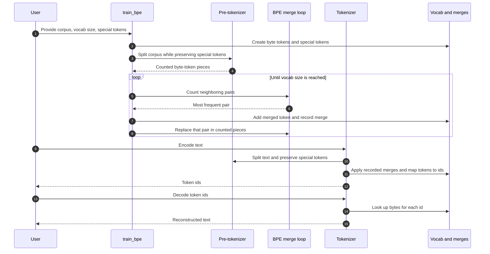

# BPE 算法说明

这个分词器使用的是 byte-level BPE。它不是从字符开始，而是从 UTF-8
字节开始。这样中文、emoji、符号和各种语言都能被表示，不需要额外的
未知字符。

## 目标

- 任意输入文本都能被编码。
- 特殊标记，比如 `<|endoftext|>`，不会被拆开。
- 训练后得到两样东西：词表和合并规则。
- 编码后的结果可以再还原成原文。
- 同一份输入重复训练时，结果保持一致。

## 词表组成

词表按下面的顺序建立：

1. 先放入 256 个基础字节。
2. 再放入用户配置的特殊标记。
3. 最后逐个加入训练过程中学到的新组合。

词表里保存的是字节内容，而不是普通字符。原因是一个中文字符或 emoji
通常会占多个 UTF-8 字节。

## 训练流程

训练的输入是文本文件，输出是词表和合并规则。

1. 读取训练文本。
2. 先把特殊标记单独识别出来，避免它们参与普通合并。
3. 把普通文本切成较小片段。
4. 把每个片段转成字节序列。
5. 统计所有相邻组合出现的次数。
6. 找到出现最多的组合。
7. 把这个组合合并成一个新 token。
8. 把新 token 加进词表，并记录这次合并规则。
9. 重复这个过程，直到词表达到目标大小，或者已经没有可合并的组合。

如果两个组合出现次数一样，代码会用固定规则打破平局，保证每次训练结果一致。

## 编码流程

编码就是把文本变成 token id。

1. 先识别特殊标记。
2. 特殊标记直接转成自己的 id。
3. 普通文本按训练时相同的方式切片。
4. 每个片段先转成字节序列。
5. 按训练得到的合并顺序执行合并。
6. 把最终 token 转成词表里的 id。

编码时会缓存重复片段，所以常见词或常见片段不用每次都重新算。

## 解码流程

解码就是把 token id 还原成文本。

1. 根据 token id 找到对应的字节内容。
2. 把所有字节拼起来。
3. 按 UTF-8 还原成文本。

## 时序图



## 一个小例子

假设训练时经常看到下面这些片段：

```text
l o w
l o w
l o w e r
```

如果 `l o` 出现最频繁，会先合并成：

```text
lo w
lo w
lo w e r
```

之后如果 `lo w` 又是最常见组合，就会继续合并成：

```text
low
low
low e r
```

这些合并顺序会被保存下来。以后编码新文本时，就按同样的顺序重新应用这些规则。
