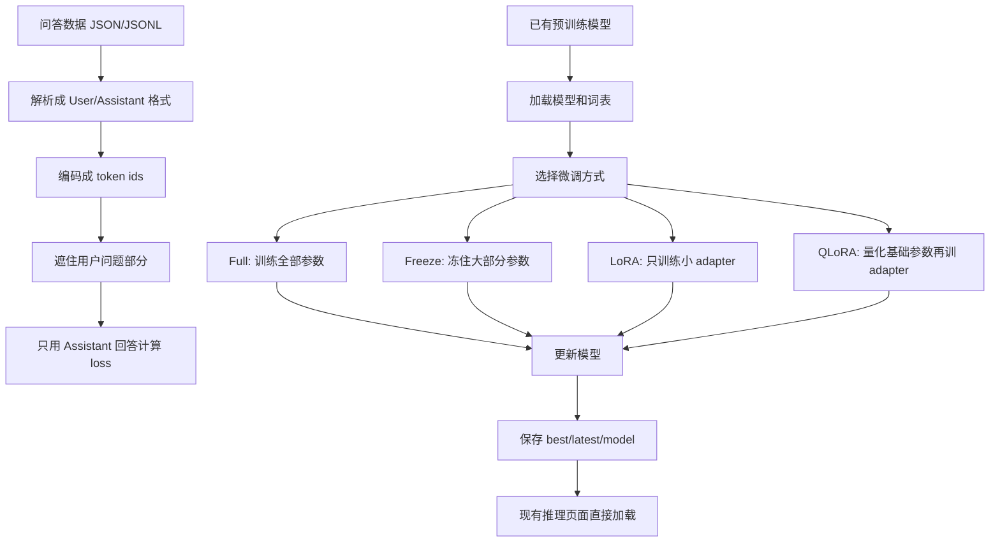
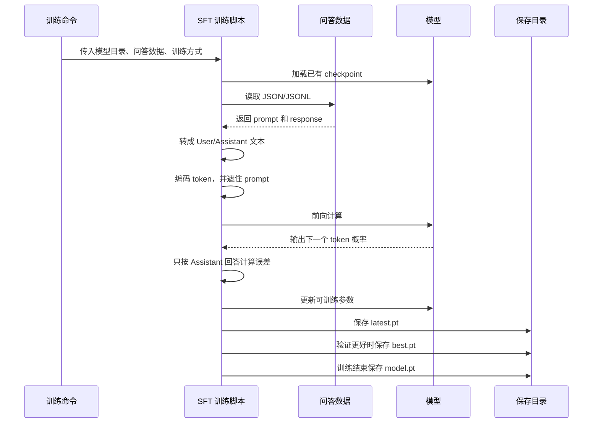

# SFT 微调说明

这部分代码用来把已经预训练好的小模型，继续训练成更像“问答助手”的模型。

预训练阶段让模型学会续写普通文本。SFT 阶段让模型看大量“用户问题 -> 助手回答”的样子，学会在看到 `User:` 后接 `Assistant:` 的回答。

## 适用场景

如果你看到模型回答像下面这样：

```text
User: who are you?
Assistant: Once upon a time...
```

说明它还在按普通文本续写。要改善这个问题，就需要 SFT。

SFT 的训练材料应该像这样：

```text
User: who are you?
Assistant: I am a small local assistant.
<|endoftext|>
```

重点不是让模型“停止续写”，而是让它学会“把续写续成回答”。

## 整体流程



## 时序图



## 数据格式

支持两类常见格式。

第一类是聊天格式：

```json
{"messages":[{"role":"user","content":"who are you?"},{"role":"assistant","content":"I am a small local assistant."}]}
```

也支持多轮对话：

```json
{"messages":[{"role":"system","content":"be concise"},{"role":"user","content":"hello"},{"role":"assistant","content":"Hi."},{"role":"user","content":"who are you?"},{"role":"assistant","content":"I am a local assistant."}]}
```

第二类是指令格式：

```json
{"instruction":"Translate this","input":"hello","response":"你好"}
```

训练脚本会把它统一整理成：

```text
User: Translate this

hello
Assistant: 你好
<|endoftext|>
```

## 为什么要遮住用户问题

普通预训练会让每个位置都参与训练：

```text
User: who are you?
Assistant: I am a local assistant.
```

如果全部参与训练，模型会同时学习“怎么写用户问题”和“怎么写助手回答”。但 SFT 的目标是让它更会回答，所以默认只让 `Assistant:` 后面的回答参与训练。

简单理解：

```text
User: who are you?        不重点学
Assistant: I am...        重点学
```

如果你确实想让 prompt 也参与训练，可以加：

```bash
--train-on-prompt
```

通常不建议一开始就开这个选项。

## 四种训练方式

### Full

Full 会训练模型的全部参数。

优点是效果上限最好，缺点是显存和时间开销最大，也更容易把原模型已经学到的东西冲掉。

适合：

- 模型很小。
- 训练数据质量高、数量足够。
- 你想最大幅度改变模型行为。

运行：

```bash
python3 -m finetune.sft.train \
  --model-dir runs/tiny_model \
  --checkpoint best.pt \
  --train-input data/sft_train.jsonl \
  --output-dir runs/sft_full \
  --method full \
  --steps 1000
```

### Freeze

Freeze 会冻住大部分模型，只训练少量部分。当前实现默认训练输出层和归一化层，也可以额外训练最后几层。

优点是省显存、训练稳，不容易把模型训坏。缺点是可调整空间小，效果提升有限。

适合：

- 数据量不大。
- 只想让模型稍微适应问答格式。
- 想先做一个便宜稳定的试验。

运行：

```bash
python3 -m finetune.sft.train \
  --model-dir runs/tiny_model \
  --checkpoint best.pt \
  --train-input data/sft_train.jsonl \
  --output-dir runs/sft_freeze \
  --method freeze \
  --freeze-last-layers 1 \
  --steps 1000
```

如果你想连词向量也一起训练，可以加：

```bash
--freeze-train-embeddings
```

### LoRA

LoRA 不直接大幅修改原来的大矩阵，而是在部分线性层旁边加一条很小的可训练分支。训练时主要更新这条小分支，原来的基础权重保持不动。

简单理解：

```text
原输出 = 原模型计算结果
新输出 = 原输出 + 小分支修正
```

优点是省显存、训练快、效果通常比 Freeze 更强。训练结束后，本项目会把 LoRA 修正合并回普通模型，所以现有推理代码可以直接加载。

适合：

- 你想做比较实用的 SFT。
- 机器显存有限。
- 不想全量训练所有参数。

运行：

```bash
python3 -m finetune.sft.train \
  --model-dir runs/tiny_model \
  --checkpoint best.pt \
  --train-input data/sft_train.jsonl \
  --output-dir runs/sft_lora \
  --method lora \
  --lora-rank 8 \
  --lora-alpha 16 \
  --steps 1000
```

常用参数：

- `--lora-rank`：小分支的容量。越大越能学，但越占资源。
- `--lora-alpha`：小分支影响强度。一般可以设成 `rank` 的 2 倍。
- `--lora-dropout`：训练时给小分支加一点随机丢弃，数据少时能减少过拟合。
- `--lora-targets`：选择哪些线性层加 LoRA。默认会覆盖注意力和前馈网络里的主要线性层。

如果想让 LoRA 之外的输出层或归一化层也参与训练，可以加：

```bash
--adapter-train-head --adapter-train-norms
```

### QLoRA

QLoRA 的思路是：基础模型权重先用更省空间的 4 位形式保存，训练时仍然只训练 LoRA 小分支。

简单理解：

```text
基础模型：压缩保存，不训练
LoRA 分支：正常训练
```

优点是比 LoRA 更省内存。缺点是基础权重被压缩后会有一点误差，小模型上收益不一定明显。

当前项目里的 QLoRA 是轻量内置版本，不依赖 `bitsandbytes`。它会把线性层基础权重量化成 4 位风格的整数权重，训练 LoRA 分支，最后再合并导出成普通模型。

适合：

- 模型更大时想省内存。
- 想比较 LoRA 和量化后 LoRA 的效果。
- 想保持推理端不改动。

运行：

```bash
python3 -m finetune.sft.train \
  --model-dir runs/tiny_model \
  --checkpoint best.pt \
  --train-input data/sft_train.jsonl \
  --output-dir runs/sft_qlora \
  --method qlora \
  --lora-rank 8 \
  --lora-alpha 16 \
  --steps 1000
```

## 推荐顺序

如果你现在只是想让模型从“续写故事”变成“像样回答问题”，建议按这个顺序试：

1. 先用 `--method freeze` 跑一小轮，确认数据格式没问题。
2. 再用 `--method lora` 正式训练。
3. 显存不够时试 `--method qlora`。
4. 模型很小、数据很多时再试 `--method full`。

一般情况下，LoRA 是最实用的起点。

## 输出文件

输出目录会包含：

```text
best.pt
latest.pt
model.pt
vocab.json
merges.json
```

含义和预训练一致：

- `best.pt`：验证效果最好的一次。
- `latest.pt`：最近一次评估保存的结果。
- `model.pt`：训练最后一步的结果。

LoRA 和 QLoRA 训练结束后也会保存成普通模型文件，所以可以直接这样启动页面：

```bash
python3 -m inference.openai_chat.server \
  --model-dir runs/sft_lora \
  --checkpoint best.pt \
  --host 127.0.0.1 \
  --port 8000
```

## 常见问题

如果回答还是像故事，优先检查训练数据是不是大量问答格式。普通文章、故事、网页文本不适合作为 SFT 主数据。

如果 loss 很低但回答很差，可能是数据太重复，模型只记住了少量模板。

如果回答混入 `<|endoftext|>`，请确认使用的是当前推理代码，当前版本已经会隐藏生成出来的结束标记。

如果模型总是答非所问，先把生成随机性调低，比如降低 `temperature`，再检查训练数据质量。

如果数据很少，优先用 Freeze 或 LoRA，不要直接 Full。
